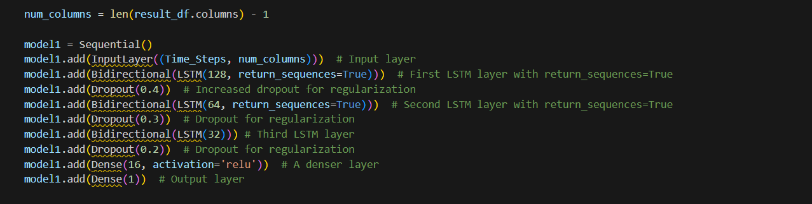
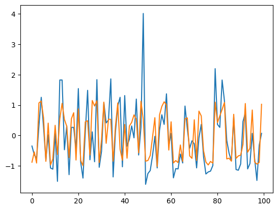

# Air Quality Visualization and Prediction
**Senior Project | University of Jeddah**

## Table of contents
- [Project Overview](#Overview)
- [The Technical Pipeline](#Pipeline)
- [Performance & Results](#Results)
- [Tech Stack](#Stack)
- [Implementation Note](#Note)

## 📌 Project Overview 

This repository contains the core Data Engineering and Deep Learning pipeline for my senior project. The goal was to process massive datasets of air quality readings and build a high-precision predictive model using a Stacked Bidirectional LSTM.

I was responsible for the technical execution, including the architecture design, data cleaning strategy, and feature engineering.

## 🛠️ The Technical Pipeline 

**Data Engineering & Integrity**  
The raw dataset consisted of 11.3M+ data points like this:  

| location_id | sensors_id | location | datetime | lat | lon | parameter | units | value | year | month | measured |
|--------|---------|---------------|---------------------------|----------|----------|------|---------|-----|------|---|---|
| 233401 | 1342890 | Riyadh-245698 | 2021-08-25T12:00:00-01:00 | 24.68122 | 46.62074 | pm25 | µg/m³ | 36  | 2021 | 8 |   |
| 233401 | 1342890 | Riyadh-245698 | 2021-08-25T16:00:00-01:00 | 24.68122 | 46.62074 | pm25 | µg/m³ | 41  | 2021 | 8 |   |
| 65623  | 402156  | IRC-60621     | 2023-02-07T00:04:46-01:00 | 22.316   | 39.092   | pm10 | µg/m³ | 7.8 | 2023 | 2 |   |
| 65623  | 402156  | IRC-60621     | 2023-02-07T00:06:46-01:00 | 22.316   | 39.092   | pm10 | µg/m³ | 8.2 | 2023 | 2 |   |

So, to ensure model stability, I implemented:  
  * **Redundancy Reduction:** Deduplicated and merged records to extract 1M high-integrity samples, reducing computational noise by 90%.  
  * **Custom AQI Extraction:** Developed a function to simplify complex parameter/unit columns into a single, actionable Air Quality Index.  
  * **Normalization:** Scaled features to prevent weight bias during the training phase.  

**Feature Engineering: Cyclical Encoding**  
To capture the periodic nature of time, I transformed temporal data into Sine and Cosine components.
  * **Logic:** This ensures the model recognizes that hour 23 and hour 0 are mathematically adjacent, preventing "cliffs" in time-series learning.  
  

**Model Architecture**  
I built a Stacked Bidirectional LSTM. Processing sequences both forwards and backwards allows the model to capture deep context in pollutant trends.  
  

**Architecture Breakdown:**
  * **Input Layer:** Designed for (Time_Steps, Features).  
  * **3-Layer Bidirectional LSTM:** Increasing depth (128 → 64 → 32 units) to extract hierarchical features.
  * **Custom Dropout Schedule:** Implemented a decreasing dropout rate (0.4 → 0.3 → 0.2) to balance heavy early regularization with deep feature extraction.  
  * **Output:** Dense layers leading to a single continuous prediction value.

## 📈 Performance & Results 
The model was optimized using the **Adam Optimizer** and monitored via **EarlyStopping** to prevent overfitting.
  * **Metric:** Reached a **Root Mean Squared Error (RMSE) of 0.7033**.  
    
  * **Outcome:** The model successfully produced the predictive data used for the final spatial GIS visualizations.

| location_id | lat      | lon      | year | month | mean_aqi |
|-------------|----------|----------|------|-------|----------|
| 233401      | 24.68122 | 46.62074 | 2024 | 1     | 74.31878 |
| 233401      | 24.68122 | 46.62074 | 2024 | 2     | 74.52453 |
| 233401      | 24.68122 | 46.62074 | 2024 | 3     | 72.45721 |
| 233401      | 24.68122 | 46.62074 | 2024 | 4     | 72.6815  |

## 🧰 Tech Stack 
**Language:** Python  
**Libraries:** Pandas, Numpy, Scikit-learn, Matplotlib, Keras, OS  
**Data Volume:** 11.3M+ records  

## 💡 Implementation Note 
The GIS mapping and final UI were handled by a teammate using the CSV output generated by this pipeline.
